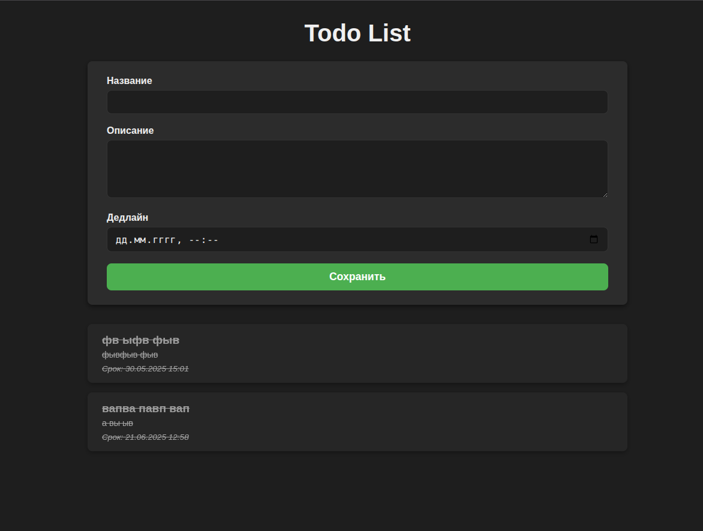

# Todo List на PHP с PDO и Vite



## Быстрый старт

1. Клонировать репозиторий и установить зависимости:

```bash
composer install
npm install
```

2. Создать базу данных MySQL:

```sql
CREATE DATABASE todo CHARACTER SET utf8mb4 COLLATE utf8mb4_unicode_ci;
```

3. Настроить подключение к базе в `src/Database/Connection.php`.

4. Выполнить миграцию (создать таблицу `todos`):

5. Запустить PHP сервер разработки:

```bash
php -S localhost:8000 -t public
```

6. Запустить Vite:

```bash
npx vite build --watch
```

Собранные файлы появятся в `public/dist`.

---

## Структура

- `public/` — точка входа и статичные файлы
- `src/` — PHP-код (контроллеры, модели, роутер)
- `assets/` — SCSS и JS для Vite

---

## Особенности

- Поддержка PATCH/DELETE через поле `_method` в формах
- Модель с кастами и Carbon для работы с датами

---